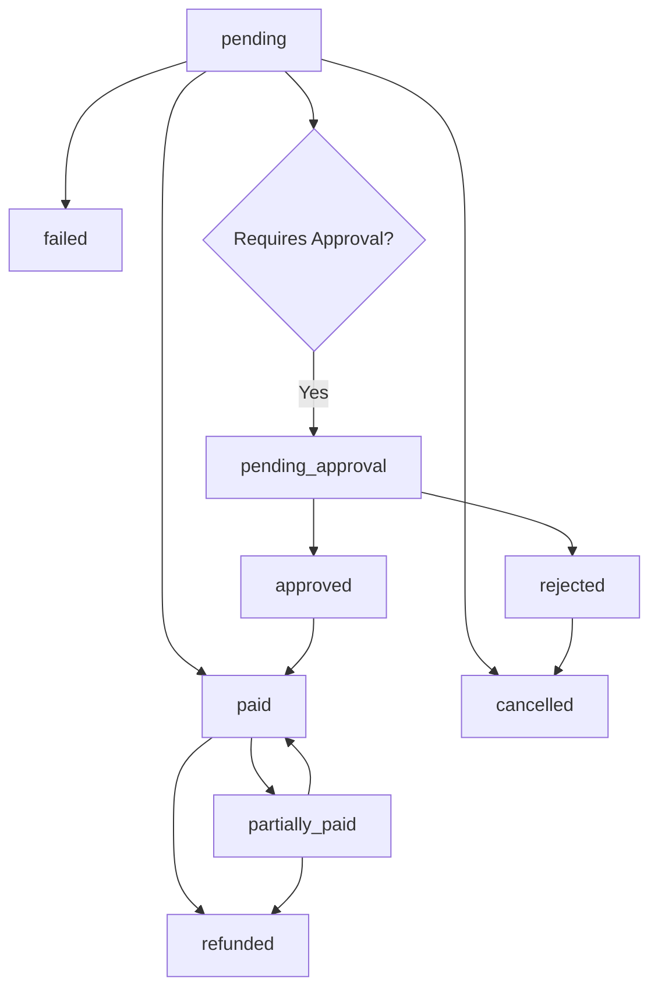

# Enhanced Payment Transaction Management API

## Overview

This document describes the comprehensive transaction management capabilities added to the FastAPI payment system. The enhancements provide full lifecycle management for payment transactions with advanced status tracking, approval workflows, refund processing, and detailed analytics.

## Key Features

### 1. **Transaction Status Management**
- Real-time status updates with audit trails
- Status history tracking with user attribution
- Automatic status transitions based on business rules
- Processing state management

### 2. **Approval Workflows**
- Configurable approval requirements
- Multi-step approval processes
- Rejection handling with reasons
- Approval notifications and tracking

### 3. **Refund Processing**
- Partial and full refund support
- Refund approval workflows
- Multiple refund methods
- Refund audit trails

### 4. **Advanced Search & Analytics**
- Multi-parameter transaction search
- Real-time analytics dashboards
- Status summaries and reporting
- Recent activity monitoring

### 5. **Comprehensive Audit Trail**
- Complete transaction lifecycle tracking
- User attribution for all changes
- Detailed change history
- Security event logging

## API Endpoints

### Transaction Status Management

#### Update Transaction Status
```http
PUT /payments/transactions/{transaction_id}/status
```

**Request Body:**
```json
{
  "status": "paid",
  "reason": "Payment confirmed by bank",
  "notes": "Additional notes about status change"
}
```

**Response:**
```json
{
  "id": "txn_id",
  "transaction_id": "TXN-20250915142030-A1B2",
  "status": "paid",
  "last_modified_by": "user_id",
  "status_history": [
    {
      "old_status": "pending",
      "new_status": "paid",
      "changed_by": "user_id",
      "changed_at": "2025-09-15T14:20:30Z",
      "reason": "Payment confirmed by bank",
      "notes": "Additional notes"
    }
  ]
}
```

#### Get Transaction Status History
```http
GET /payments/transactions/{transaction_id}/history
```

**Response:**
```json
{
  "transaction_id": "TXN-20250915142030-A1B2",
  "current_status": "paid",
  "status_history": [
    {
      "old_status": "pending",
      "new_status": "paid",
      "changed_by": "user_id",
      "changed_by_name": "John Smith",
      "changed_at": "2025-09-15T14:20:30Z",
      "reason": "Payment confirmed",
      "notes": "Bank confirmation received"
    }
  ]
}
```

### Advanced Transaction Search

#### Search Transactions
```http
GET /payments/transactions/search
```

**Query Parameters:**
- `status[]`: Array of status values (pending, paid, failed, etc.)
- `payment_methods[]`: Array of payment methods
- `student_query`: Search by student name, ID, or email
- `amount_min` / `amount_max`: Amount range filters
- `date_from` / `date_to`: Date range filters
- `reference_number`: Search by reference/receipt number
- `collected_by`: Filter by collector
- `requires_approval`: Filter by approval requirement
- `skip` / `limit`: Pagination

**Example Request:**
```http
GET /payments/transactions/search?status=pending&status=paid&amount_min=100&amount_max=1000&student_query=john&limit=50
```

**Response:**
```json
{
  "transactions": [
    {
      "transaction_id": "TXN-20250915142030-A1B2",
      "amount": 500.00,
      "status": "paid",
      "student_name": "John Smith",
      "student_student_id": "STU001",
      "payment_date": "2025-09-15T14:20:30Z",
      "payment_method": "bank_transfer"
    }
  ],
  "total_count": 125,
  "filtered_count": 25,
  "skip": 0,
  "limit": 50
}
```

### Approval Workflows

#### Approve Transaction
```http
POST /payments/transactions/{transaction_id}/approve
```

**Request Body:**
```json
{
  "action": "approve",
  "reason": "Documents verified and payment confirmed",
  "notes": "All requirements met"
}
```

**Response:**
```json
{
  "message": "Transaction approved successfully",
  "transaction_id": "TXN-20250915142030-A1B2",
  "new_status": "paid",
  "approved_by": "user_id",
  "approval_date": "2025-09-15T14:25:00Z"
}
```

#### Reject Transaction
```http
POST /payments/transactions/{transaction_id}/reject
```

**Request Body:**
```json
{
  "reason": "Insufficient documentation",
  "notes": "Missing bank statement"
}
```

#### Get Pending Approvals
```http
GET /payments/transactions/pending-approvals
```

**Response:**
```json
{
  "payments": [
    {
      "transaction_id": "TXN-20250915142030-A1B2",
      "amount": 1500.00,
      "student_name": "Jane Doe",
      "student_student_id": "STU002",
      "payment_date": "2025-09-15T10:30:00Z",
      "requires_approval": true,
      "approval_status": "pending"
    }
  ],
  "total_count": 15,
  "current_count": 15
}
```

### Refund Processing

#### Process Refund
```http
POST /payments/transactions/{transaction_id}/refund
```

**Request Body:**
```json
{
  "refund_amount": 250.00,
  "refund_reason": "Course cancellation",
  "refund_method": "bank_transfer",
  "notes": "Student withdrew from course"
}
```

**Response:**
```json
{
  "message": "Refund initiated successfully",
  "refund_id": "ref_id",
  "transaction_id": "TXN-20250915142030-A1B2",
  "refund_amount": 250.00,
  "status": "pending_approval",
  "reference_number": "REF-20250915142530-C3D4"
}
```

### Analytics & Reporting

#### Transaction Analytics
```http
GET /payments/analytics/status-summary
```

**Query Parameters:**
- `days`: Number of days to analyze (default: 30)

**Response:**
```json
{
  "status_summary": {
    "paid": 125,
    "pending": 15,
    "failed": 3,
    "refunded": 2
  },
  "recent_activity": [
    {
      "transaction_id": "TXN-20250915142030-A1B2",
      "amount": 500.00,
      "status": "paid",
      "student_name": "John Smith",
      "payment_date": "2025-09-15T14:20:30Z"
    }
  ],
  "total_count": 145,
  "total_amount": 72500.00,
  "pending_approval_count": 8,
  "overdue_count": 12,
  "generated_at": "2025-09-15T14:30:00Z"
}
```

#### Recent Transaction Activity
```http
GET /payments/analytics/recent-activity
```

**Query Parameters:**
- `limit`: Maximum number of transactions (default: 50)
- `hours`: Time window in hours (default: 24)

**Response:**
```json
{
  "activity": [
    {
      "transaction_id": "TXN-20250915142030-A1B2",
      "amount": 500.00,
      "status": "paid",
      "payment_method": "bank_transfer",
      "student_name": "John Smith",
      "collected_by": "cashier_01",
      "payment_date": "2025-09-15T14:20:30Z"
    }
  ],
  "count": 25,
  "period_hours": 24
}
```

## Payment Status Workflow

### Status Transitions



### Status Descriptions

| Status | Description | Next Possible States |
|--------|-------------|---------------------|
| `pending` | Initial state, payment not confirmed | `paid`, `failed`, `cancelled` |
| `paid` | Payment completed successfully | `refunded`, `partially_paid` |
| `partially_paid` | Partial payment received | `paid`, `refunded` |
| `failed` | Payment processing failed | `pending` (retry) |
| `cancelled` | Payment was cancelled | `pending` (reopen) |
| `refunded` | Full refund processed | None (terminal) |
| `overdue` | Payment past due date | `paid`, `cancelled` |

## Authentication & Authorization

### TEST_MODE Authentication
When `TEST_MODE=true`, all endpoints use mock authentication:
```json
{
  "id": "test_user_123",
  "email": "test@example.com",
  "role": "super_admin",
  "branch_id": "all"
}
```

### Production Authentication
In production mode, all endpoints require valid JWT tokens with appropriate permissions:
- `payment:read` - View transactions
- `payment:write` - Create/update transactions
- `payment:approve` - Approve transactions
- `payment:refund` - Process refunds
- `payment:admin` - Full payment management

## Error Handling

### Standard Error Response
```json
{
  "detail": "Error description",
  "error_code": "PAYMENT_001",
  "timestamp": "2025-09-15T14:30:00Z"
}
```

### Common Error Codes

| Code | Description | HTTP Status |
|------|-------------|-------------|
| `PAYMENT_001` | Transaction not found | 404 |
| `PAYMENT_002` | Invalid status transition | 400 |
| `PAYMENT_003` | Insufficient permissions | 403 |
| `PAYMENT_004` | Approval required | 400 |
| `PAYMENT_005` | Refund amount exceeds original | 400 |

## Audit Trail

All transaction operations are logged with:
- **User Attribution**: Who performed the action
- **Timestamp**: When the action occurred
- **Before/After Values**: What changed
- **Reason/Notes**: Why the change was made
- **IP Address**: Source of the request
- **User Agent**: Client information

### Audit Log Entry Example
```json
{
  "action": "payment_status_changed",
  "user_id": "user_123",
  "user_name": "John Admin",
  "entity_type": "payment_transaction",
  "entity_id": "TXN-20250915142030-A1B2",
  "old_values": {"status": "pending"},
  "new_values": {"status": "paid"},
  "details": {
    "reason": "Bank confirmation received",
    "notes": "Manual verification completed"
  },
  "timestamp": "2025-09-15T14:30:00Z",
  "ip_address": "192.168.1.100",
  "severity": "info"
}
```

## Testing

### Setup Test Environment
```bash
export TEST_MODE=true
export ENVIRONMENT=development
export DATABASE_URL=mongodb://localhost:27017/school_db_test
```

### Run Test Suite
```bash
cd backend
python test_enhanced_payment_apis.py
```

### Expected Test Results
The test suite covers:
- ✅ API connectivity and authentication
- ✅ Student search functionality
- ✅ Transaction creation
- ✅ Status updates with audit trails
- ✅ Approval/rejection workflows
- ✅ Refund processing
- ✅ Advanced search capabilities
- ✅ Analytics and reporting
- ✅ Status history tracking

## Performance Considerations

### Database Indexing
Ensure these indexes exist for optimal performance:
```javascript
// Payment transactions collection
db.payment_transactions.createIndex({"transaction_id": 1}, {unique: true})
db.payment_transactions.createIndex({"student_id": 1, "branch_id": 1})
db.payment_transactions.createIndex({"payment_date": -1})
db.payment_transactions.createIndex({"status": 1, "branch_id": 1})
db.payment_transactions.createIndex({"requires_approval": 1, "approval_status": 1})

// Audit logs collection
db.audit_logs.createIndex({"timestamp": -1})
db.audit_logs.createIndex({"user_id": 1, "timestamp": -1})
db.audit_logs.createIndex({"entity_type": 1, "entity_id": 1})
```

### Caching Strategy
- Transaction status summaries: 5-minute cache
- Student search results: 1-minute cache
- Analytics data: 15-minute cache
- Recent activity: 30-second cache

## Security Features

### Input Validation
- All monetary amounts validated for positive values
- Status transitions validated against business rules
- User permissions checked for all operations
- SQL injection prevention through parameterized queries

### Rate Limiting
- 100 requests per minute per user
- 10 requests per minute for approval operations
- 5 requests per minute for refund operations

### Data Protection
- Sensitive payment data encrypted at rest
- Audit logs retained for 7 years
- PCI DSS compliance for card data
- GDPR compliance for personal data

## Migration Guide

### From Basic to Enhanced APIs

1. **Update Status Management**:
   ```python
   # Old way
   await db.payment_transactions.update_one(
       {"_id": ObjectId(transaction_id)},
       {"$set": {"status": "paid"}}
   )

   # New way
   await payment_service.update_transaction_status(
       transaction_id=transaction_id,
       status_update=TransactionStatusUpdate(
           status=PaymentStatus.PAID,
           reason="Payment confirmed"
       ),
       user_id=current_user["id"]
   )
   ```

2. **Enhanced Search**:
   ```python
   # Old way
   transactions = await db.payment_transactions.find({
       "status": "pending"
   }).to_list(100)

   # New way
   results = await payment_service.search_transactions(
       search_params=TransactionSearchParams(
           status=[PaymentStatus.PENDING],
           amount_min=100.0,
           student_query="john"
       ),
       branch_id=branch_id
   )
   ```

## Support & Troubleshooting

### Common Issues

1. **"Transaction not found" errors**
   - Verify transaction_id format
   - Check branch_id permissions
   - Ensure transaction exists in database

2. **"Permission denied" errors**
   - Verify user has required permissions
   - Check branch access rights
   - Confirm TEST_MODE settings

3. **Status transition failures**
   - Review allowed status transitions
   - Check business rule constraints
   - Verify approval requirements

### Debug Mode
Enable debug logging:
```bash
export LOG_LEVEL=DEBUG
export AUDIT_LOG_LEVEL=DEBUG
```

### Health Checks
```http
GET /payments/test-info
```
Returns system status and configuration.

---

## Conclusion

The enhanced payment transaction management system provides enterprise-grade capabilities for handling the complete payment lifecycle. With comprehensive audit trails, flexible approval workflows, and powerful analytics, it addresses all the identified issues with transaction status management while maintaining compatibility with existing payment creation APIs.