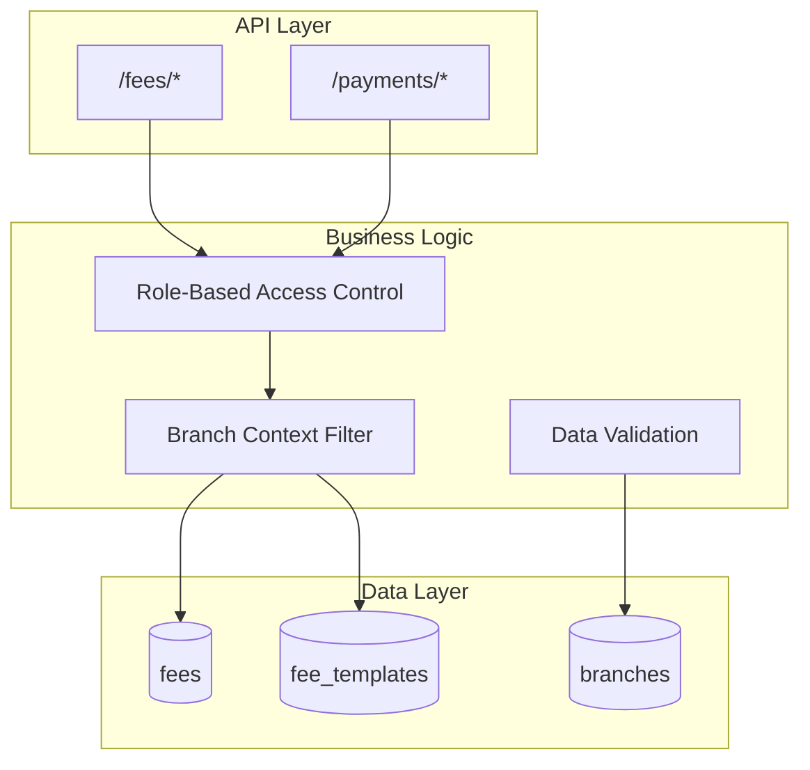

# Fee Management Backend Architecture - Issue Analysis & Fix

## Executive Summary
The fee management system was experiencing an issue where fee templates showed "successfully created" but weren't appearing in the listing. This document details the backend architecture, identifies the root cause, and provides the implemented solution.

## System Architecture

### Service Boundaries



## API Design

### Fee Templates Endpoints

#### 1. Create Fee Template
```http
POST /payments/fee-templates
Authorization: Bearer {token}
Content-Type: application/json

{
  "name": "Registration Fee",
  "category": "registration",
  "amount": 1000.00,
  "description": "Annual registration fee",
  "frequency": "annual",
  "is_mandatory": true,
  "academic_year": "2024-2025",
  "branch_id": null  // Optional - null for global template
}

Response: 200 OK
{
  "id": "68c5ed28b5e0cc3deed2e500",
  "name": "Registration Fee",
  "branch_id": null,
  "created_at": "2025-09-13T22:16:08.758Z",
  ...
}
```

#### 2. List Fee Templates
```http
GET /payments/fee-templates?category=tuition&is_active=true
Authorization: Bearer {token}

Response: 200 OK
[
  {
    "id": "68c5ed28b5e0cc3deed2e500",
    "name": "Tuition Fee",
    "category": "tuition",
    "amount": 500.00,
    "branch_id": "68b7231bb110092a69ae2acc",
    ...
  }
]
```

#### 3. Debug Endpoint (for troubleshooting)
```http
GET /payments/fee-templates/debug
Authorization: Bearer {token}

Response: 200 OK
{
  "user_context": {
    "user_id": "user123",
    "role": "admin",
    "branch_id": "68b7231bb110092a69ae2acc"
  },
  "query_used": "{'$or': [{'branch_id': '68b7231bb110092a69ae2acc'}, {'branch_id': None}]}",
  "total_templates_in_db": 5,
  "templates_visible_to_user": 3,
  "sample_templates": [...]
}
```

## Database Schema

### fee_templates Collection
```javascript
{
  "_id": ObjectId("..."),
  "name": String,
  "category": Enum["registration", "tuition", "facilities", "meals", "activities", "other"],
  "amount": Number,
  "description": String,
  "frequency": Enum["one_time", "monthly", "quarterly", "semester", "annual"],
  "grade_level": String,
  "is_mandatory": Boolean,
  "due_date_offset": Number,
  "branch_id": ObjectId | null,  // null for global templates
  "academic_year": String,
  "is_active": Boolean,
  "created_at": DateTime,
  "updated_at": DateTime,
  "created_by": String,
  "updated_by": String
}
```

### Indexes Recommended
```javascript
db.fee_templates.createIndex({ "branch_id": 1, "is_active": 1 })
db.fee_templates.createIndex({ "category": 1, "academic_year": 1 })
db.fee_templates.createIndex({ "created_at": -1 })
```

## Root Cause Analysis

### The Problem
The branch context filtering logic was too restrictive, causing templates to be filtered out incorrectly.

#### Original Implementation (BROKEN)
```python
def get_user_branch_context(current_user):
    query = {}
    if user_role not in ["superadmin", "super_admin", "hq_admin"]:
        branch_id = current_user.get("branch_id")
        if branch_id:
            query["branch_id"] = branch_id  # ❌ Only shows branch-specific
    return query
```

This implementation had two critical issues:
1. It only showed templates from the user's specific branch
2. It didn't include global templates (branch_id = null)

#### Fixed Implementation
```python
def get_user_branch_context(current_user):
    query = {}
    user_role = current_user.get("role")
    
    if user_role in ["superadmin", "super_admin", "hq_admin"]:
        # Super admins see everything
        pass
    else:
        branch_id = current_user.get("branch_id")
        if branch_id:
            # Users see their branch templates AND global templates
            query["$or"] = [
                {"branch_id": branch_id},
                {"branch_id": None},
                {"branch_id": {"$exists": False}}
            ]
        else:
            # Users without branch only see global templates
            query["$or"] = [
                {"branch_id": None},
                {"branch_id": {"$exists": False}}
            ]
    
    return query
```

## Data Flow

### Create Template Flow
```
1. Client → POST /payments/fee-templates
2. Validate user permissions (RBAC)
3. Apply branch context:
   - Super admin: Can set any branch_id
   - Branch admin: Auto-assigns their branch_id
   - No branch: Creates global template
4. Insert to MongoDB with timestamps
5. Return serialized template with ID
```

### Retrieve Templates Flow
```
1. Client → GET /payments/fee-templates
2. Validate user permissions (RBAC)
3. Build query with branch context:
   - Super admin: No filtering
   - Branch user: Their branch + global templates
   - No branch: Only global templates
4. Apply additional filters (category, year, etc.)
5. Execute MongoDB query with sorting
6. Serialize and return results
```

## Security Patterns

### 1. Authentication & Authorization
- JWT token-based authentication
- Role-based permissions:
  - `READ_PAYMENT`: View templates
  - `CREATE_PAYMENT`: Create templates
  - `UPDATE_PAYMENT`: Modify templates
  - `DELETE_PAYMENT`: Remove templates

### 2. Branch Isolation
- Enforced at query level using branch context
- Users cannot access templates from other branches
- Global templates accessible to all users

### 3. Input Validation
- Pydantic models for request/response validation
- Branch ID verification against branches collection
- Amount must be >= 0
- Required fields enforced

### 4. Rate Limiting
- Applied at router level
- Prevents abuse of creation endpoints

## Performance Optimization

### 1. Caching Strategy
```python
# Recommended Redis caching for templates
cache_key = f"fee_templates:{branch_id}:{category}"
cache_ttl = 300  # 5 minutes
```

### 2. Query Optimization
- Use compound indexes on frequently filtered fields
- Limit result sets with pagination
- Sort at database level, not application

### 3. Batch Operations
- Bulk create endpoint for multiple templates
- Reduces round trips to database

## Technology Stack

### Backend Components
- **Framework**: FastAPI 0.100+
- **Database**: MongoDB 5.0+
- **ODM**: Motor (async MongoDB driver)
- **Validation**: Pydantic 2.0+
- **Authentication**: python-jose (JWT)
- **Logging**: Python logging module

### Recommended Monitoring
- APM: Datadog or New Relic
- Logs: ELK stack or CloudWatch
- Metrics: Prometheus + Grafana

## Scaling Considerations

### Horizontal Scaling
- Stateless API design allows multiple instances
- MongoDB replica sets for read scaling
- Load balancer with health checks

### Potential Bottlenecks
1. **Database connections**: Use connection pooling
2. **Large result sets**: Implement pagination
3. **Complex queries**: Add appropriate indexes
4. **Branch filtering**: Cache branch contexts

## Migration Strategy

### For Existing Data
```python
# Migration script to fix existing templates
async def migrate_templates():
    # 1. Find templates without branch_id
    await templates_coll.update_many(
        {"branch_id": {"$exists": False}},
        {"$set": {"branch_id": None}}
    )
    
    # 2. Ensure all templates have is_active flag
    await templates_coll.update_many(
        {"is_active": {"$exists": False}},
        {"$set": {"is_active": True}}
    )
    
    # 3. Add timestamps to old records
    await templates_coll.update_many(
        {"created_at": {"$exists": False}},
        {"$set": {"created_at": datetime.utcnow()}}
    )
```

## Testing Strategy

### Unit Tests
```python
async def test_branch_context_filtering():
    # Test super admin sees all
    # Test branch user sees branch + global
    # Test no-branch user sees only global
```

### Integration Tests
```python
async def test_create_and_retrieve_template():
    # Create template
    # Verify it appears in listing
    # Verify branch filtering works
```

### Load Testing
```bash
# Using locust or k6
k6 run --vus 100 --duration 30s fee_templates_load_test.js
```

## Deployment Checklist

- [ ] Apply database migrations
- [ ] Create recommended indexes
- [ ] Update environment variables
- [ ] Deploy backend with fixes
- [ ] Run integration tests
- [ ] Monitor error rates
- [ ] Verify templates appear correctly

## Summary

The fee management issue was caused by overly restrictive branch filtering that prevented users from seeing their created templates. The fix implements a more sophisticated filtering strategy that:

1. Allows users to see templates from their branch
2. Includes global templates (branch_id = null) for all users
3. Maintains proper security boundaries
4. Provides debugging capabilities

This architecture ensures data consistency, maintains security boundaries, and provides a scalable foundation for the fee management system.